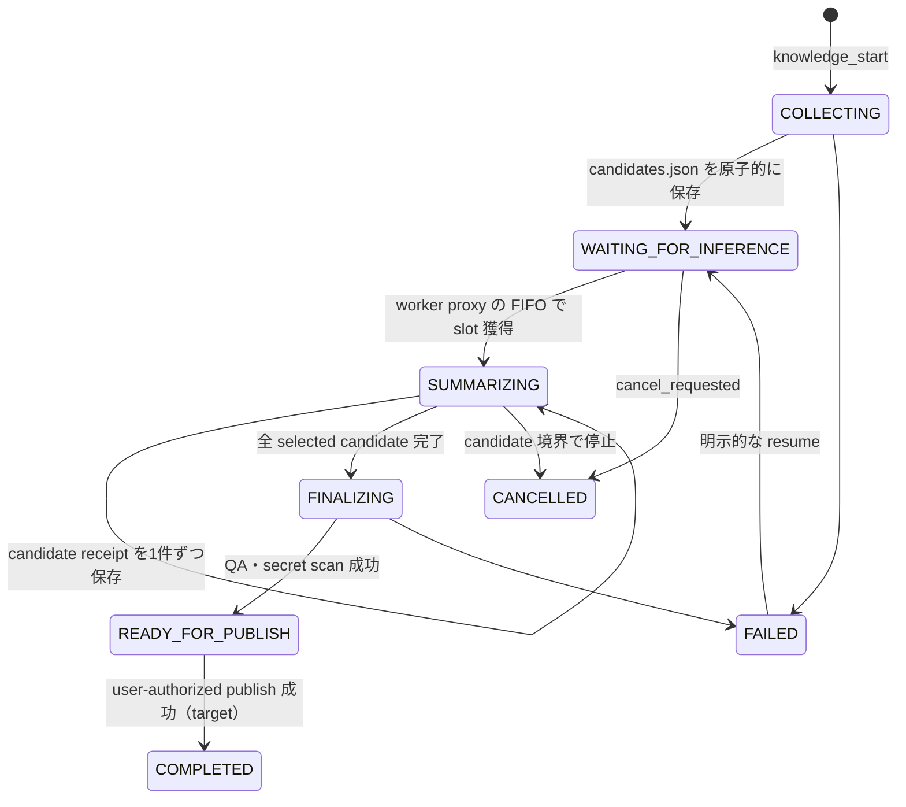
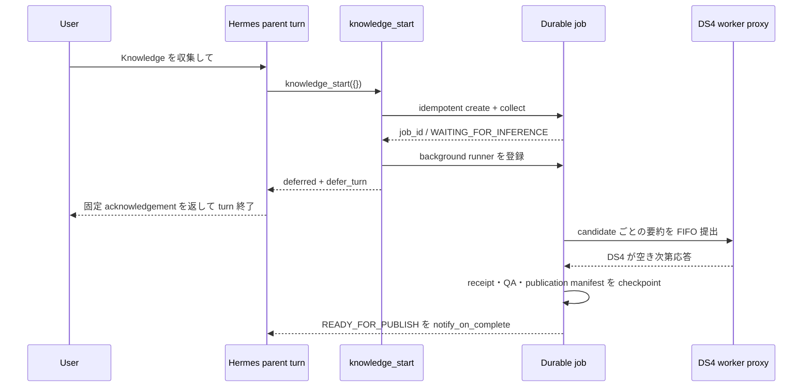

# Knowledge 永続ジョブと Hermes turn defer 設計

## 目的

Hermes の親ターンが DS4 を使っている最中でも、Knowledge 収集を安全に受理し、
手動の待機、モデル切替、再実行なしで完了させる。

今回の障害はプロセス同士の厳密な deadlock ではなく、次の自己競合をモデルが
文章で再検討し続ける semantic livelock だった。

1. 親ターンが DS4 を利用する。
2. 同じ親ターンが `collect.sh` の inference idle gate を通そうとする。
3. gate は親ターン自身の接続を busy と判定する。
4. モデルが同じ代替案を生成し直し、ツール実行にも turn 終了にも進まない。

## 採用する構成

DS4 は 1 slot のまま維持し、次の 3 点を組み合わせる。

- `knowledge_start` を LLM 推論と分離した専用ツールにする。
- 収集結果と進捗を `.work/jobs/<job_id>/` に永続化する。
- ツール成功時の `defer_turn` を Hermes harness の状態遷移として扱う。

親ターン側は次の順で終える。

## 排他と責務

| 機構 | 責務 | 責務に含めないもの |
|---|---|---|
| Knowledge job lock | 同じ job の runner 重複と final commit 競合を防ぐ | DS4 の空き判定 |
| worker proxy `MAX_CONCURRENT=1` | DS4 の同時推論数を 1 に保つ | Knowledge job の成否 |
| worker proxy queue | Hermes と Knowledge の要求順序を管理する | repo transaction |
| job state | waiting/running/retry/cancel/完了を永続化する | socket の生存判定 |
| 18080/18082 の接続観測 | restart 等の破壊的操作の安全確認 | collect の admission |

従来の `.work/lock/pid` を DS4 予約と repo run lock の両方に使わない。
新しいジョブ経路は collect 前の inference idle gate を呼ばず、要約は worker proxy
の通常キューへ投入する。

## 永続データ契約

`state.json` は一時ファイルへの `fsync` と `os.replace` で更新する。最低限、次を
保存する。

- `job_id`、`idempotency_key`、origin session/turn
- `phase`、`created_at`、`updated_at`、`run_started_at`
- 開始時の HEAD、checkpoint/config の SHA-256
- candidates と summary receipt の相対 path と SHA-256
- selected/completed candidate ID、attempt、retry 時刻
- runner lease、`cancel_requested`
- 最終 commit、完了通知の delivery 状態、失敗理由

外部由来の title、本文、モデル出力は `state.json` やログへ入れない。
候補本文は既存の `candidates.json`、要約は candidate ごとの receipt に限定する。
`READY_FOR_PUBLISH` の finalize receipt は単独で権限にしない。crash resume 時も
side-effect-free finalizer と全 QA を再実行し、manifest digest を再計算する。

## Hermes `defer_turn` 契約

`defer_turn` は tool result 内の任意 JSON を信用して判定しない。Hermes core が
tool execution context を発行し、信頼済み plugin がその context に対して defer を
要求する。

defer が成立したら harness は次を必ず行う。

1. 実行済み tool result を SessionDB へ永続化する。
2. 同じ batch の未実行 sibling tool に `skipped_due_to_defer` result を付ける。
3. 固定 acknowledgement を assistant message として保存・配信する。
4. 同じ親ターンから次の LLM API call を行わず終了する。
5. persistence failure や tool failure の場合は defer を破棄し、成功扱いにしない。

## 失敗時の扱い

- collect 失敗: canonical data を変えず `FAILED`。
- DS4 busy: error にせず `WAITING_FOR_INFERENCE` のまま proxy queue で待つ。
- runner crash: receipt のある candidate は再送しない。途中 candidate だけ再試行する。
- 同じ user turn からの再呼び出し: idempotency key で同じ job を返す。
- cancel: 実行中 HTTP request を強制切断せず、candidate 境界と commit 前で停止する。
- HEAD/checkpoint drift: canonical data を上書きせず失敗させ、reconciler が新しい
  checkpoint から再収集する。
- completion event の重複: job の completion/delivery receipt で 1 回に畳む。
- conversation job の検証完了: `READY_FOR_PUBLISH` で止め、background から
  commit/push しない。

## テストゲート

| 層 | 必須テスト |
|---|---|
| Knowledge state | atomic write、path traversal 拒否、phase 遷移、cancel |
| idempotency | 同一 key の同時 start が job を 1 件だけ作る |
| crash resume | receipt 保存後・state 更新前の crash でも再要約しない |
| inference | collect は idle gate を呼ばない、要約だけ proxy を使う |
| transaction | partial summary/QA failure/HEAD drift/READY_FOR_PUBLISH で data と checkpoint が不変 |
| Hermes core | deferred tool 後に追加 LLM call なし、sibling tool は未実行 |
| plugin | command/working directory 固定、任意引数不可、session-bound cancel |
| real-path E2E | 一時 `HERMES_HOME` の実 plugin discovery/registry/SessionDB/runner/defer を通す |
| completion | background 登録、再起動後 reconcile、通知重複排除 |

## 今回の変更境界

最初の vertical slice は、永続 state、candidate receipt、`knowledge_start/status/cancel`、
Hermes の generic `defer_turn`、background completion、`READY_FOR_PUBLISH` までとする。
DS4 の第 2 slot、socket-based の別 idle gate、background commit/push、モデルによる
「後で再実行」判断は導入しない。

現時点で永続なのは Knowledge job と summary/finalize receipt である。Hermes core の
defer request は、tool result と固定 acknowledgement を SessionDB へ flush するまでの
短い区間だけ process memory にある。Gateway がその区間で停止した場合は job 自体を
`knowledge_status` で再発見できるが、親 turn の acknowledgement 再配信は未実装である。
また、Gateway 再起動時の runner sweep と completion delivery ledger も次段の P0 とし、
本番切替前に restart/reconcile/重複通知テストを追加する。

### 本番切替前の P0

vertical slice を runtime へ反映する前に、次を完了させる。

1. **publication authority**: background job が会話 turn の外で直接 commit/push
   しない。既定は `READY_FOR_PUBLISH` まで進め、同じ session の次の直接 user turn
   で exact job/HEAD/output digest に束縛した `knowledge_publish` を実行する。明示的な
   standing consent を導入する場合も、core-owned authority claim から job 固有の
   one-shot capability を発行し、terminal から偽造できない契約にする。
2. **finalize journal**: repo 全体の finalize lock と durable journal を追加する。
   canonical file の置換前、commit 後、push 検証後を記録し、SIGKILL 後は開始 HEAD と
   job trailerを照合して rollback または同じ OID の reconcile だけを行う。
3. **retry / sweep**: proxy の queue timeout、503、接続切断は bounded backoff 付きの
   `WAITING_FOR_INFERENCE` へ戻す。Gateway/runner 起動時に非 terminal job を sweep し、
   lease 切れ job だけを再開する。
4. **delivery ledger**: completion event は event ID と delivery receipt を永続化し、
   crash 前後の at-least-once 配送を user-visible には 1 回へ畳む。
5. **core pin**: `defer_turn`、`halt_on_error`、direct-user authority を同時に含む Hermes
   commit を専用 branch で検証し、castle の expected revision と同じ commit に固定する。
6. **immutable runner boundary**: Gateway からは clean かつ revision 固定済みの Knowledge
   package/launcher だけを実行し、継承環境を allowlist にする。mutable な checkout の
   `src` と `.venv` を Gateway の全環境変数付きで直接実行しない。
7. **legacy capability closure**: モデル到達可能な `merge --commit` と任意 job ID の
   `status/cancel` を閉じる。cron publish と会話 publish はそれぞれ host-owned capability
   へ束縛し、通常 index、remote URL、開始 remote OID を検証する。
8. **real-path E2E**: 一時 `HERMES_HOME` で実 plugin discovery、registry dispatch、
   SessionDB flush、host-local runner 起動、成功 defer、error 時 defer 破棄を 1 本で検証する。

これらが未完了の間は setup の core contract を通さず、Gateway へ plugin を配布しない。
