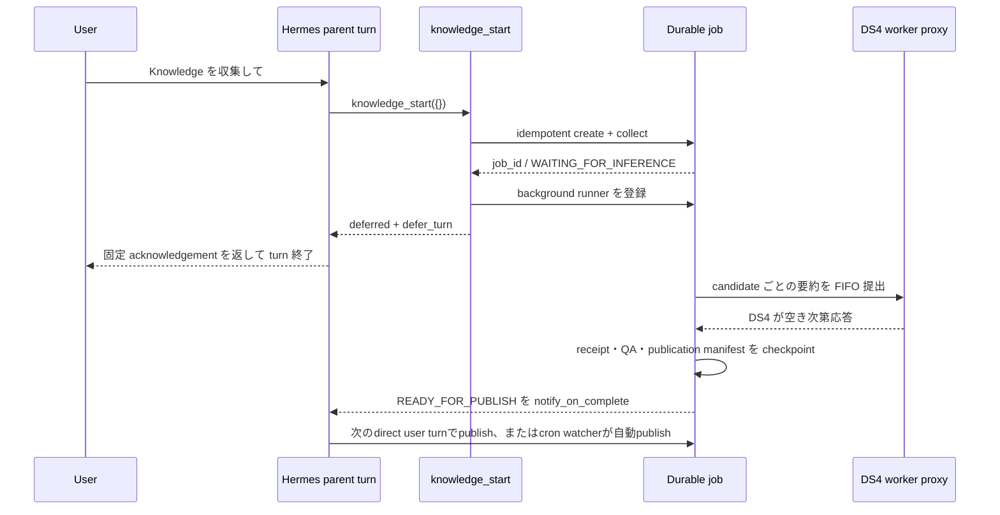

# Knowledge 永続ジョブと Hermes turn defer 設計

## 目的

Hermes の親ターンが DS4 を使っている最中でも、Knowledge 収集を安全に受理し、
手動の待機、モデル切替、再実行なしで完了させる。

今回の障害はプロセス同士の厳密な deadlock ではなく、次の自己競合をモデルが
文章で再検討し続ける semantic livelock だった。

1. 親ターンが DS4 を利用する。
2. 同じ親ターンが `collect.sh` の inference idle gate を通そうとする。
3. gate は親ターン自身の接続を busy と判定する。
4. モデルが同じ代替案を生成し直し、ツール実行にも turn 終了にも進まない。

## 採用する構成

DS4 は 1 slot のまま維持し、次の 3 点を組み合わせる。

- `knowledge_start` を LLM 推論と分離した専用ツールにする。
- 収集結果と進捗を `.work/jobs/<job_id>/` に永続化する。
- ツール成功時の `defer_turn` を Hermes harness の状態遷移として扱う。

親ターン側は次の順で終える。

## 排他と責務

| 機構 | 責務 | 責務に含めないもの |
|---|---|---|
| Knowledge job lock | 同じ job の runner 重複と final commit 競合を防ぐ | DS4 の空き判定 |
| worker proxy `MAX_CONCURRENT=1` | DS4 の同時推論数を 1 に保つ | Knowledge job の成否 |
| worker proxy queue | Hermes と Knowledge の要求順序を管理する | repo transaction |
| job state | waiting/running/retry/cancel/完了を永続化する | socket の生存判定 |
| 18080/18082 の接続観測 | restart 等の破壊的操作の安全確認 | collect の admission |

従来の `.work/lock/pid` を DS4 予約と repo run lock の両方に使わない。
新しいジョブ経路は collect 前の inference idle gate を呼ばず、要約は worker proxy
の通常キューへ投入する。

## 永続データ契約

`state.json` は一時ファイルへの `fsync` と `os.replace` で更新する。最低限、次を
保存する。

- `job_id`、`idempotency_key`、origin session/turn/authority kind
- `phase`、`created_at`、`updated_at`、`run_started_at`
- 開始時の HEAD、canonical remote URL、remote main OID、checkpoint/config の SHA-256
- candidates と summary receipt の相対 path と SHA-256
- selected/completed candidate ID、attempt、retry 時刻
- runner lease、`cancel_requested`
- 最終 commit、失敗理由

外部由来の title、本文、モデル出力は `state.json` やログへ入れない。
候補本文は既存の `candidates.json`、要約は candidate ごとの receipt に限定する。
`READY_FOR_PUBLISH` の finalize receipt は単独で権限にしない。crash resume 時も
side-effect-free finalizer と全 QA を再実行し、manifest digest を再計算する。

## Hermes `defer_turn` 契約

`defer_turn` は tool result 内の任意 JSON を信用して判定しない。Hermes core が
tool execution context を発行し、信頼済み plugin がその context に対して defer を
要求する。

defer が成立したら harness は次を必ず行う。

1. 実行済み tool result を SessionDB へ永続化する。
2. 同じ batch の未実行 sibling tool に `skipped_due_to_defer` result を付ける。
3. 固定 acknowledgement を assistant message として保存・配信する。
4. 同じ親ターンから次の LLM API call を行わず終了する。
5. persistence failure や tool failure の場合は defer を破棄し、成功扱いにしない。

## 失敗時の扱い

- collect 失敗: canonical data を変えず `FAILED`。
- DS4 busy: error にせず `WAITING_FOR_INFERENCE` のまま proxy queue で待つ。
- runner crash: receipt のある candidate は再送しない。途中 candidate だけ再試行する。
- 同じ user turn からの再呼び出し: idempotency key で同じ job を返す。
- cancel: 実行中 HTTP request を強制切断せず、candidate 境界と commit 前で停止する。
- HEAD/checkpoint drift: canonical data を上書きせず失敗させ、reconciler が新しい
  checkpoint から再収集する。
- completion通知: best-effortだけとし、再送ledgerやuser-visible exactly-onceは設けない。
  job stateと`knowledge_status`を正本にする。
- conversation job の検証完了: `READY_FOR_PUBLISH` で止め、background から
  commit/push しない。

## テストゲート

| 層 | 必須テスト |
|---|---|
| Knowledge state | atomic write、path traversal 拒否、phase 遷移、cancel |
| idempotency | 同一 key の同時 start が job を 1 件だけ作る |
| crash resume | receipt 保存後・state 更新前の crash でも再要約しない |
| inference | collect は idle gate を呼ばない、要約だけ proxy を使う |
| transaction | partial summary/QA failure/HEAD drift/READY_FOR_PUBLISH で data と checkpoint が不変 |
| Hermes core | deferred tool 後に追加 LLM call なし、sibling tool は未実行 |
| plugin | command/working directory 固定、任意引数不可、session-bound cancel |
| real-path E2E | 一時 `HERMES_HOME` の実 plugin discovery/registry/SessionDB/runner/defer を通す |
| completion | background 登録、再起動後 reconcile、通知失敗でもdurable stateを保持 |

## 実装済み境界

DS4の第2 slot、socket-basedの別idle gate、モデルによる「後で再実行」判断は導入しない。
実装済みの安全境界は次のとおり。

1. **parent turn defer**: `knowledge_start`はLLM-free collectとrunner登録後にだけ
   core-owned deferを要求する。harnessはtool resultと固定acknowledgementをflushし、
   追加のLLM callなしでturnを終了する。
2. **durable recovery**: collect success receipt、candidate/summary/finalize receipt、
   runner lock、heartbeat、typed bounded retry、startup sweepを使う。lease時刻は診断値で、
   runner lockを取得できたことをlivenessの根拠にする。
3. **opaque publication capability**: Hermes coreはraw tokenを保存せずSHA-256だけを保持する。
   coreはpluginがcanonical化したopaque bytesへだけ束縛する。pluginとKnowledgeがdirect userの
   publication manifest、またはscheduled job IDと開始HEADのschemaを検証し、1回だけ消費する。
4. **scheduled convenience**: cronは`knowledge_start({})`だけを呼び、READY後はin-memory
   watcherが自動公開する。Gateway再起動でtokenを失ったREADY jobは、次回cronが新規収集
   より先にscheduler-proven capabilityで回収する。要約途中のscheduled jobも再利用し、
   receipt前に停止したcollectだけは元のdurable origin bindingで再収集する。
5. **exact Git publication**: 開始時の通常indexは空を要求するがcommit内容の根拠にしない。
   private indexとGit plumbingでcanonical 2ファイルだけのcommit objectとexact index bytesを
   作る。private bytesのclaimをhard linkで`.git/index.lock`へ原子的に取得し、通常indexが
   開始時digestのままか確認してからHEADをCASする。所有するlockだけをindexへrenameし、
   promotion後に通常の`git add`が新しいindexへ置換済みなら上書きしない。lockだけ失われて
   通常indexが開始時digestのままならclaimから標準lockを再取得してpromotionを完了する。
   journalはexact claim digestとsame-inode証明があるartifactだけを削除する。hooks・任意Git config・任意credential
   helperを無効化し、固定HTTPS URLへexact OIDをpushしてremote OIDを再読する。検証後の
   `origin/main`は開始時OIDから検証済みOIDへのcompare-and-swapだけを許す。
6. **legacy closure**: `merge --commit`、`knowledge.host_publish`、旧cron/collect shellは
   model到達経路から除外またはexit 64。status/cancelはorigin sessionへ束縛し、pluginは
   terminalからbundle/job API/legacy scriptを直接呼ぶ操作をblockする。
7. **root-owned revision bundle**: castle setupはcleanなKnowledge `main == remote main`を
   実remote OIDで検証する。full OIDのsourceとlauncherをNix storeへ追加し、pluginにはその
   exact store pathもpinする。Hermes UIDから書けないbundleだけをallowlist環境で起動し、
   pin後のmain子commitはcanonical data 2ファイルだけを許す。
8. **test gates**: Knowledge全pytest、Hermes公式test wrapper、plugin contract、実plugin
   discovery/registry/SessionDB/defer E2Eを通す。

## 残る制約

- Hermes coreのdefer requestは、SessionDB flushが終わるまでprocess memoryにある。
  その短い区間でGatewayが停止してもjobは再発見できるが、親turn acknowledgementの
  厳密な再配信までは保証しない。
- background completion通知はbest-effortであり、Gateway停止をまたぐ再送保証はしない。
  durable job stateと`knowledge_status`を正本にする。
- scheduled capabilityはprocess memoryだけに置く。Gateway停止時はjobをREADYで止め、
  tokenをdiskへ保存せず、次回cronの新しいcore-proven authorityで回収する。
- runtime切替はKnowledge/Hermesのcommit pinをcastleへ反映し、`nrs`を実行した後に有効になる。
